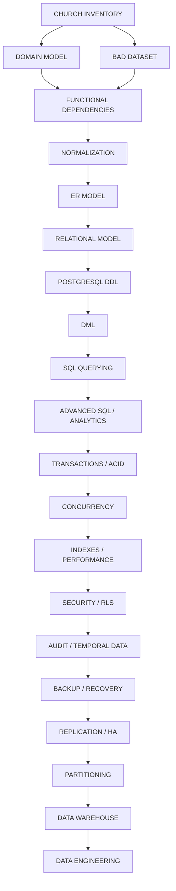

# Church Equipment & Inventory Management Database

This project is a comprehensive laboratory for mastering database engineering, DBA concepts, and data engineering.
The central problem is **institutional asset accountability and lifecycle management**.

## The Core Problem

> A church needs reliable knowledge of what equipment it owns, where it is, who is responsible for it, what condition it is in, where it came from, how much it cost, when it was used or moved, what maintenance it has received, and what has happened to it over its entire lifecycle.

## Project Roadmap & Timeline (Sept 3 - Sept 21)

We are operating on a strict 18-day timeline to complete the database evolution.

| Phase / Milestone | Dates | Duration | Focus |
| :--- | :--- | :--- | :--- |
| **1. Domain Modeling & Unnormalized Data** | Sept 3 - Sept 4 | 2 Days | Domain extraction, recognizing anomalies |
| **2. Database Design** | Sept 5 - Sept 6 | 2 Days | Functional dependencies, Normalization (1NF-BCNF), ER Modeling |
| **3. Core Database Construction** | Sept 7 - Sept 9 | 3 Days | PostgreSQL DDL, constraints, DML, basic querying |
| **4. Advanced SQL & Analytics** | Sept 10 - Sept 11 | 2 Days | Subqueries, Window functions, Aggregation |
| **5. Operational Integrity** | Sept 12 - Sept 13 | 2 Days | Transactions (ACID), Concurrency, Locks, MVCC |
| **6. Performance Engineering** | Sept 14 - Sept 15 | 2 Days | B-Trees, Execution Plans (`EXPLAIN`), Indexing |
| **7. Administration & Security** | Sept 16 - Sept 18 | 3 Days | Row-Level Security (RLS), Auditing, Backup & Recovery |
| **8. Data Engineering** | Sept 19 - Sept 21 | 3 Days | Star Schema, OLTP vs OLAP, Materialized Views |

## Evolutionary Roadmap

The database will evolve organically. Each evolution forces you to learn another part of database engineering:

## Documentation Standards

All diagrams and architectural representations in this repository MUST be written in **Mermaid** or **PlantUML** (exported to SVG).
