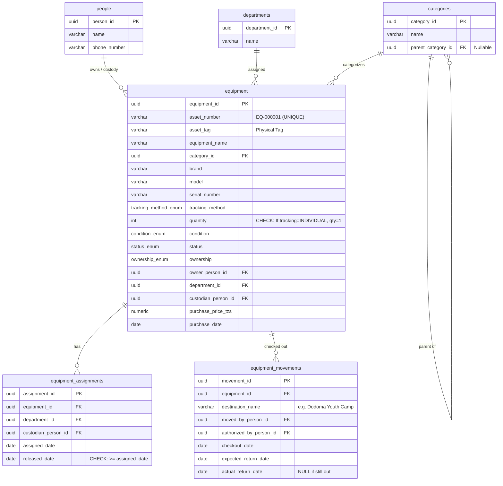

# Phase 2: Entity-Relationship (ER) Model

This ER diagram maps the physical schema for the Church Equipment Database based on the normalized V1 Data Dictionary.

## Database Schema Diagram

## Notes and Constraints
* **Primary Keys:** We are using surrogate IDs (e.g., `EQ-000001`, `DEP-001`) as defined in the consolidation phase.
* **Asset Tags:** `asset_tag` is distinctly separate from `equipment_id` and remains blank until physical verification.
